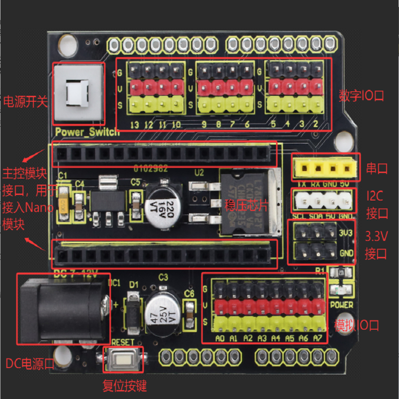

# KE0187 keyes NANO 扩展板 兼容Arduino Nano3.0/4.0

## 1.介绍

本产品是一款基于 Arduino Nano的扩展板，可兼容 Arduino Nano 3.0版本与Nano 4.0版本，适合嵌入式学习、原型开发及电子项目应用。支持 Windows（32位、64位）及Linux 系统，无需额外下载器即可快速上手。同时也支持通过ISP接口进行程序烧录，满足多样化开发需求。也提供丰富的I/O资源与稳定的电源设计，其有着12个数字I/O引脚（6个支持PWM输出），将数字和模拟端口扩展为 3PIN 接口（G-GND V-5V S-数字端口/模拟端口）。此外，扩展板一方面可以为 NANO 控制板供电;另一方面，它也稳定输出5V（输出电流1.5A），通过稳压芯片LM7805为外部传感器/模块供电。最后，5V也可以通过AMS1117芯片转换为3.3V，并由引脚引出。同时，该扩展板还配备了一个重置按钮和一个信号指示灯。侧面预留的两排2.54mm焊盘孔则可以引出NANO控制板的所有外部接口。

## 2.规格参数
- 支持ISP口烧录程序
- 工作电压：5V
- 外部输入电压：DC 7-12V
- 电流：板载5V稳压芯片L7805，可输出电流1.5A
- 最大功率：7W
- 数字I/O引脚：12个（其中6个可提供PWM输出）
- 模拟输入引脚：8个
- 工作温度范围：-20摄氏度到60摄氏度
- 排针/母排针间距：2.54mm
- 直接固定孔：3mm
- 尺寸：57.3* 53.5 MM
- 环保属性：ROHS
## 3.接口描述

## 4.连接图

插入Arduino Nano 4.0开发板USB接口需朝向需与电源开关方向一致，如上图所示.

插入Arduino Nano 3.0开发板USB接口需朝向需与电源开关方向一致，如上图所示.

